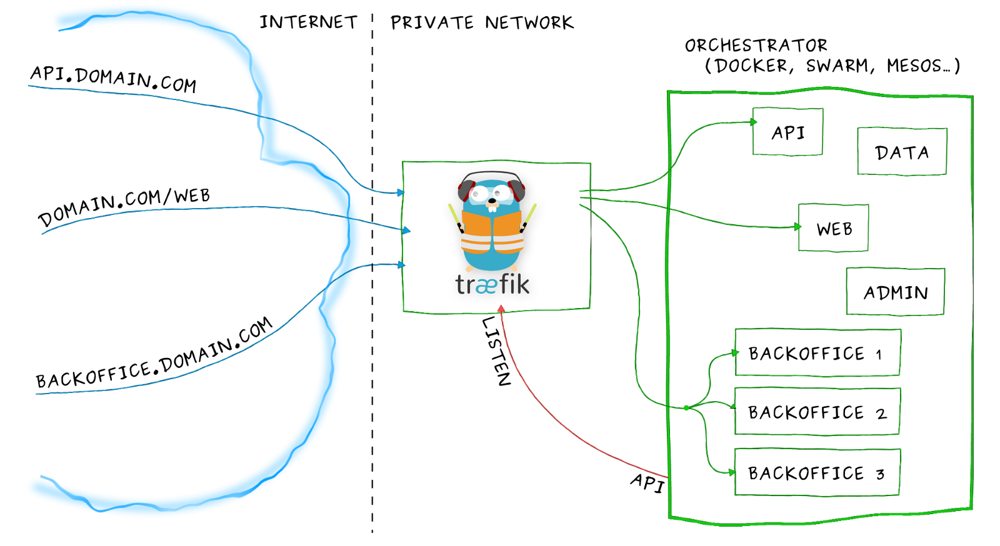

## What is Traefik

Træfik is a modern HTTP reverse proxy and load balancer that makes deploying microservices easy. Træfik integrates with your existing infrastructure components (Docker, Swarm mode, Kubernetes, Marathon, Consul, Etcd, Rancher, Amazon ECS, ...) and configures itself automatically and dynamically. Telling Træfik where your orchestrator is could be the only configuration step you need to do.

## What is an Ingress in Kubernetes/AKS

An Ingress is a collection of rules that allow inbound connections to reach the cluster services.

     Internet
        |
     Ingress
        |
     Services

## What is an Ingress Controller in Kubernetes/AKS

In order for the Ingress resource to work, the cluster must have an Ingress controller running. This is unlike other types of controllers, which typically run as part of the kube-controller-manager binary, and which are typically started automatically as part of cluster creation. You need to choose the ingress controller implementation that is the best fit for your cluster, or implement one. Common Ingress Controllers are Nginx, Traffic and cloud specific integeration. 

In order for the Ingress resource to work, the cluster must have an Ingress controller running. This is unlike other types of controllers, which typically run as part of the kube-controller-manager binary, and which are typically started automatically as part of cluster creation. You need to choose the ingress controller implementation that is the best fit for your cluster, or implement one. We currently support and maintain GCE and nginx controllers.

## Loadbalancing using the Traefik Ingress Controller

Create the following Deployment and Service for Traefik. This will create an Azure load balancer to act as a front end for Traefik. 
You can also choose to run Traefik as a Daemonset. Configuring Traefik as a Daemonset will cause the application to run on every
node in the cluster.

---
apiVersion: v1
kind: ServiceAccount
metadata:
  name: traefik-ingress-controller
  namespace: kube-system
---
kind: Deployment
apiVersion: extensions/v1beta1
metadata:
  name: traefik-ingress-controller
  namespace: kube-system
  labels:
    k8s-app: traefik-ingress-lb
spec:
  replicas: 1
  selector:
    matchLabels:
      k8s-app: traefik-ingress-lb
  template:
    metadata:
      labels:
        k8s-app: traefik-ingress-lb
        name: traefik-ingress-lb
    spec:
      serviceAccountName: traefik-ingress-controller
      terminationGracePeriodSeconds: 60
      containers:
      - image: traefik
        name: traefik-ingress-lb
        args:
        - --api
        - --kubernetes
        - --logLevel=INFO
---
kind: Service
apiVersion: v1
metadata:
  name: traefik-ingress-service
  namespace: kube-system
spec:
  selector:
    k8s-app: traefik-ingress-lb
  ports:
    - protocol: TCP
      port: 80
      name: web
    - protocol: TCP
      port: 8080
      name: admin
  type: NodePort

## Create an ingress resource and test the application by using the following manifest files. This will expose the Træfik Web UI.

apiVersion: v1
kind: Service
metadata:
  name: traefik-web-ui
  namespace: kube-system
spec:
  selector:
    k8s-app: traefik-ingress-lb
  ports:
  - port: 80
    targetPort: 8080
---
apiVersion: extensions/v1beta1
kind: Ingress
metadata:
  name: traefik-web-ui
  namespace: kube-system
  annotations:
    kubernetes.io/ingress.class: traefik
spec:
  rules:
  - host: traefik-ui.minikube
    http:
      paths:
      - backend:
          serviceName: traefik-web-ui
          servicePort: 80

## Test this by finding the load balancer IP address of the Traefik Ingress service. 

            jordan-nielsen: kubectl get svc --namespace=kube-system
            NAME                      TYPE           CLUSTER-IP     EXTERNAL-IP     PORT(S
            traefik-ingress-service   LoadBalancer   10.0.173.222   52.151.60.102 

Next modify your hosts file to test things out.

            127.0.0.1	localhost
            255.255.255.255	broadcasthost
            52.151.60.102   traefik-ui.minikube

You should now be able to visit traefik-ui.minikube in the browser and view the Træfik web UI. 
You will eventually want to use DNS, but this is a good way to quickly test and make sure Traefik is working correctly. 

## Now lets test with a very simple Nginx web application

For more information visit the Traefik github page for more information on Kubernetes integeration. 

https://github.com/containous/traefik/blob/master/docs/user-guide/kubernetes.md

https://docs.traefik.io/user-guide/kubernetes/